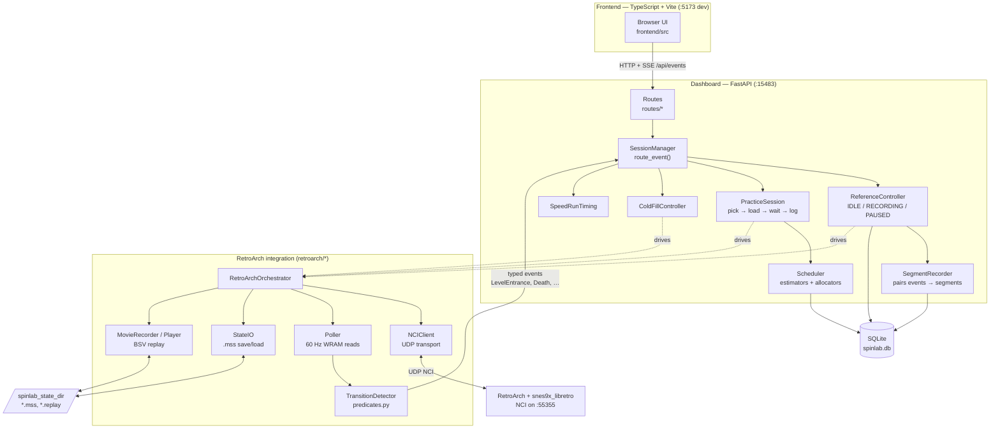

# SpinLab Diagrams

Living collection of architecture and flow diagrams. Each section is independent — add new ones as `## <Title>` blocks. The authoritative prose lives in [docs/ARCHITECTURE.md](docs/ARCHITECTURE.md); this file is for the visual cross-references.

## High-Level Architecture

Notes / deliberate simplifications:

- The poller actually owns two detectors (`TransitionDetector` + `ColdFillSpawnDetector`); the cold-fill one is folded into `ColdFillController` here since that's the consumer.
- `Poller`, `StateIO`, and `MovieRecorder` all funnel through `NCIClient` — only the orchestrator-owned edges are drawn to keep the picture readable.
- The reference state machine (IDLE/RECORDING/PAUSED) is shown only as a label; a proper rendering would be a separate `stateDiagram-v2`.
