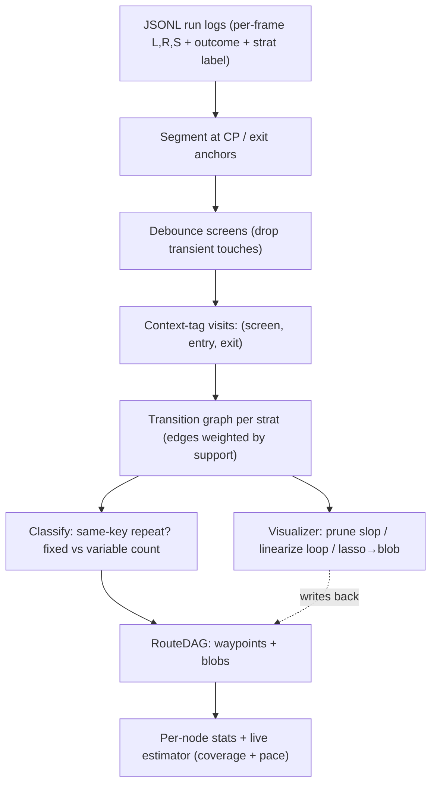
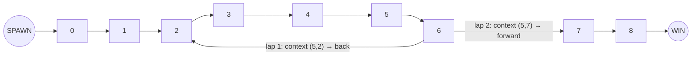

# LRS Progress-Structure Discovery — Design & Handoff

> Handoff doc for Claude Code. Goal: turn many **LRS** (Level / Room / Screen) run-traces
> of a speedrun route into (a) an automatically discovered **progress structure**
> (a DAG of waypoints + blobs) and (b) per-segment **statistics** (death rate, time,
> live mid-run remaining estimate) that **degrade gracefully** where LRS can't see, plus a
> **human-in-the-loop visualizer** to prune / linearize / lump. Plugs into the existing
> Mesen2 Lua passive recorder → JSONL pipeline.

---

## 0. TL;DR of the model

We never build a probabilistic transition model (it mis-handles required loops: "0 loops likely, 7 possible").
Instead we:

1. **Segment** each run at hard game anchors (checkpoints / exits) — the only truly reliable monotone markers.
2. **Debounce** screens to drop transient corner-clips.
3. **Context-tag** every screen visit with `(entry, exit)` = `(prev_screen, next_screen)`. This is a *bin label*, not a Markov chain — it stratifies stats so aliased visits stop being averaged together.
4. Build a **support-weighted transition graph** per strat label. High-support = route backbone; low-support = slop.
5. **Classify** each recurring state by one rule (below) into waypoint / loop / blob.
6. Represent the route as a **DAG of waypoints and blobs**, all with a uniform `(entry, exits, time-dist, outcome-dist)` interface.
7. Estimate live remaining time from **coverage + pace-so-far** (pace = a free surrogate for hidden state like P-speed/skill). Widen intervals honestly where observables stop disambiguating.

**The one classification rule (keep this central):**
> **same `(screen, entry, exit)` key repeats within a single run → aliased.**
> Of those: **fixed repeat-count across runs → unroll** (it's a resolvable loop).
> **variable repeat-count → blob** (it's a boss/grind). This is reversible as data grows.

---

## 1. Hard-won principles (do not regress on these)

- **Order is fragile; coverage and local context are robust.** Don't define progress by live position. Define it by *first-arrival frontier* (which states seen) and *local `(entry,exit)` context*.
- **Loops are observed, not predicted.** You know which lap you're on because you *crossed the junction*, not from a probability. Use a **counter**, not a distribution.
- **Context-tagging is stratification, not a sequence model.** It re-imports zero of the Markov/Dirichlet baggage. Win/Death/Spawn are just special token values in the keys, not states you predict your way into.
- **Time you can watch accrue (use the clock); risk you cannot (stay near population estimate).** But both per-screen stats suffer identically from averaging heterogeneous visits — context bins fix both.
- **Pace-so-far is the hand-pick-free fallback** for hidden state. The hidden thing (P-speed, today's skill) casts a shadow on observables; regress on the shadow.
- **Hand-picked bytes (powerup, key, P-switch, hit-count) are an optimization, never the foundation.** They're cleaner context dimensions when present; the system must work without them.
- **Degradation bottoms out in honest uncertainty**, not a confident wrong number. Widen the interval where you can't disambiguate; never average two incompatible situations into one mean and report it confidently.

---

## 2. Vocabulary / data model

- **LRS**: `(level, room, screen)` read each frame.
- **Anchor**: a hard, un-spoofable game event — checkpoint flag set, level/exit transition. Segment boundaries.
- **Segment**: span between two anchors (e.g. CP→CP). The unit statistics are bucketed in.
- **Tokens**: `SPAWN` (source), `WIN` / `DEATH` (absorbing ends). Outcomes are just exit-token values.
- **Visit**: one debounced occupancy of a screen, tagged `(entry, exit)` where entry/exit are the adjacent screens or tokens.
- **Context key**: `(screen, entry, exit)`. The stratification key.
- **Waypoint**: a node = a `(screen, context[, lap_index])` with a time distribution and an exit-outcome distribution.
- **Blob**: a lumped opaque region. Same interface as a waypoint, but its internals are *temporal* — competing WIN/DEATH hazards over **elapsed-time-in-blob**, no internal screen localization.
- **RouteDAG**: the per-strat DAG of waypoints + blobs from SPAWN to WIN, with support-weighted edges.

---

## 3. Pipeline



---

## 4. Stage details (algorithms)

### 4.1 Ingestion & segmentation
- Parse JSONL → typed `Event(frame, level, room, screen, flags, outcome)`.
- Carry a per-run **strat / category label** (from config or a sidecar; the player knows which strat they ran).
- Split into `Segment`s at anchor transitions (CP set, exit/level change).
- Emit `SPAWN` at segment start; emit `WIN` (advanced to next anchor) or `DEATH` (reset) at segment end.

### 4.2 Debounce
- A screen only becomes a `Visit` if held ≥ `debounce_frames` (config, e.g. 6–10).
- Kills Z-wiggle corner-clips before they ever become visits or junctions. **Run debounce before context-tagging** so clips don't pollute `(entry,exit)` keys.

### 4.3 Context tagging
- For each `Visit`, set `entry = prev debounced screen (or SPAWN)`, `exit = next debounced screen (or WIN/DEATH)`.
- This separates the spatially-aliased cases: normal pass `(1,3)` vs pipe `(8,3)` vs clip `(1,1)`.

### 4.4 Transition graph + support
- Per strat label, build a directed graph. Nodes = `(screen)` or `(screen, context)`. Edges = observed transitions.
- **Support** per edge/node = fraction of runs containing it (and/or frequency). Backbone = high-support SPAWN→WIN path(s). Branches above threshold = real alternate strats/routes (keep as DAG forks). Below threshold = slop (prune or surface in viz).

### 4.5 Structure classification — the core rule
For each `(screen, entry, exit)` key:
- **No within-run repeat** → clean **waypoint** (split into its context bins).
- **Repeats within a single run** → context-blind / aliased. Then look at repeat-count across runs:
  - **Fixed count** (low variance, within `fixed_count_tolerance`, e.g. always 2 laps) → **resolvable loop → unroll** into lap-indexed waypoints. Lap index is recovered by counting crossings of the **bounding junction** (a neighboring screen whose context *does* split).
  - **Variable count** (variance > `blob_repeat_variance_threshold`) → **blob**.
- Find lump regions via SCC/cycle detection on the graph; a cyclic region whose members are context-blind repeats with variable count collapses to one blob.
- **Reversible**: re-run classification as runs accumulate. A blob whose variance falls below threshold becomes an unrolled loop, and vice versa.

**Worked example — trace `0 1 2 3 4 5 6 2 3 4 5 6 7 8`:**
- `2`: `(1,3)` then `(6,3)` → two distinct keys → **junction, splits**.
- `6`: `(5,2)` then `(5,7)` → two distinct keys → **junction, splits**.
- `3,4,5`: `(2,4)/(3,5)/(4,6)` **twice with the same key** → context-blind interior.
- Repeat count is fixed (always 2) → **unroll**. Lap index for `3,4,5` comes from counting the `6→2` loopback. You know you're on lap 2 of screen 4 *because you crossed the junction*, not from any probability.


> `2` and `6` are junctions (context splits them). `3,4,5` are context-blind interior, lap-indexed by the junction counter. A boss `0 8 0 8 0 8 …` is the same picture with **no** splitting junction and a **variable** lap count → it collapses to a single blob.

### 4.6 Representation: RouteDAG of waypoints + blobs
- Uniform node interface: `entry context(s)`, `exit outcomes {next-screen | WIN | DEATH}`, `time distribution`, `outcome distribution`.
- Waypoint internals: empirical time + outcome dists per context bin.
- Blob internals: `WIN`/`DEATH` competing hazards as a function of **elapsed-time-in-blob**; bounded by its entry/exit transitions; carries wide uncertainty by design.

### 4.7 Statistics & live estimation
- **Per node**: time distribution; `death_rate = P(exit = DEATH | screen, context)` — falls out of the same context binning, so it de-aliases for free.
- **Live remaining TIME** (must update mid-segment): do **not** deplete a count-bag (count↔time mismatch). Key on `(coverage reached, pace-so-far)`:
  - `pace_ratio ρ = elapsed_so_far / typical_elapsed_to_here`
  - `remaining ≈ ρ × typical_remaining_from_here`, or better, the empirical remaining-time distribution among past runs at similar coverage **and** similar ρ.
  - Use a **coarse coverage key** (count of distinct context-states cleared, or which CP) to keep sample counts dense.
- **Live DEATH risk**: rare terminal event with little within-run signal → stay near population-at-coverage estimate, ρ as a weak covariate.
- **Uncertainty floor**: where context can't split and no observable fingerprint exists (boss final phase), widen the interval instead of emitting a point.

---

## 5. Graceful degradation — the unifying rule
> **Resolve structure to exactly the granularity that local context + elapsed time can support; lump and widen the error bars beyond it.**
- Linear level → every screen a sharp waypoint.
- Loops / tangled puzzles → junctions sharp, interiors blurred (lap-indexed by counter, interpolated by elapsed time).
- Boss / grind → one blob, time-hazard internals, wide intervals.

---

## 6. Visualizer (human-in-the-loop) — the slop pruner
Automation proposes the graph; the human prunes the ambiguous middle. This is also the honest answer to "we can't fully auto-discover the chain" — we don't have to.
- **Render**: transition graph; nodes = `(screen[, context])`; edges weighted by support → **width/color by support** so slop shows up as hair-thin strays. Overlay all runs so the backbone glows. Hover shows per-node time dist + death rate.
- **Auto-highlight** the spots the classifier is unsure about (variable context-blind repeats, tangles like `676878…`) and ask: *loop or blob?*
- **Operations (each maps to a model op):**
  - delete faint edges → support-prune slop.
  - lasso a cycle → **linearize** (unroll into lap-indexed waypoints).
  - lasso a tangle → **collapse to blob** (the `S 6 7 8 0 8 0 8 0 1 2 3 E → S 6 7 [08] 1 2 3 E` move).
  - merge / split context bins → fix over- or under-aliasing.
- Edits write back to the RouteDAG; everything is re-runnable as data grows.

---

## 7. Open problems / known edge cases (do NOT silently "solve" these)
1. **Phase aliasing (boss).** Same `(entry,exit)` every lap, the only difference is a hidden counter (HP). Unrecoverable from LRS → blob + elapsed-time hazard, or fold in a hand-picked byte if available.
2. **Counter robustness.** Lap-counting can be fooled by Z-wiggles and slop-backtracks. **Only increment on debounced, high-support backbone junctions**, never on raw/stray transitions.
3. **Lost-Yoshi re-grab / rare required backtrack** (go back 3 screens, then resume). Rare but real. Classify as a low-support conditional branch under its strat, or a recognized sub-loop; flag for manual confirm. Do not auto-prune as slop just because it's rare.
4. **Tangled multi-screen cycles** (`676878767678`). Same-key test fires, but unroll-vs-blob is genuinely ambiguous → route to the visualizer.
5. **Rare-but-required branches** (powerup detours). Pure support thresholding misclassifies. Mitigate with strat labels + manual confirm.
6. **Threshold tuning.** `debounce_frames`, `support_threshold`, `fixed_count_tolerance`, `blob_repeat_variance_threshold` all need tuning. Expose in config; make classification re-runnable.

---

## 8. Build plan (phased)

Stack assumption: Python 3.11+, type hints, `dataclasses`, YAML config, JSONL logs from the existing recorder. Tests on classifier + estimator logic.

**Suggested module layout**
```
lrs_discovery/
  models.py      # Event, RunLog, Segment, Visit, ContextKey, Node, Blob, RouteDAG
  ingest.py      # JSONL -> RunLog; segmentation at anchors; strat tagging
  debounce.py    # transient-touch filtering
  context.py     # (entry,exit) tagging
  graph.py       # transition graph + support weights (per strat)
  classify.py    # same-key-repeat test; fixed/variable; waypoint/loop/blob; SCC detection
  represent.py   # build RouteDAG
  stats.py       # per-node time/outcome distributions; segment aggregates
  estimate.py    # live: coverage+pace -> remaining time; death risk; intervals
  config.py      # YAML load
  viz/           # later phase (graph render + edit ops + write-back)
```

**Dataclass sketch**
```python
@dataclass
class Visit:
    screen: int
    entry: int | str   # prev screen or "SPAWN"
    exit: int | str    # next screen or "WIN"/"DEATH"
    start_frame: int
    end_frame: int

@dataclass
class Node:
    key: tuple          # (screen, entry, exit) [, lap_index]
    times_ms: list[int]
    outcomes: dict[str, int]   # {"WIN":n, "DEATH":n, "<next_screen>":n}
    support: float

@dataclass
class Blob:
    member_screens: set[int]
    entries: set; exits: set
    # internals are temporal: hazard(t_in_blob) for WIN and DEATH
    win_hazard: object; death_hazard: object
    support: float
```

**Phases (each ends shippable + tested)**
- **Phase 0 — Ingest & segment.** JSONL → `RunLog`; segment at anchors; SPAWN/WIN/DEATH tokens; strat label. *Done when:* a real run round-trips into typed segments with correct outcomes.
- **Phase 1 — Debounce + context.** Produce the `(screen, entry, exit)` visit stream. *Done when:* a known Z-wiggle clip is filtered and a pipe entry gets a distinct context from a normal entry.
- **Phase 2 — Graph + support.** Per-strat transition graph with support weights. *Done when:* backbone vs slop is separable by a threshold on a multi-run sample.
- **Phase 3 — Classify.** Same-key-repeat test → waypoint/loop/blob; SCC detection; fixed-vs-variable count. *Done when:* the `0123456 23456 78` trace classifies `2,6` as junctions, `3,4,5` as a fixed loop interior, and a synthetic variable boss as a blob. Make it idempotent/re-runnable.
- **Phase 4 — Represent + stats.** Build RouteDAG; per-node time/outcome dists; death_rate as `P(exit=DEATH)`. *Done when:* a node's death rate de-aliases by entry context.
- **Phase 5 — Live estimator.** Coverage+pace → remaining-time distribution; population death risk; uncertainty intervals that widen in blobs. *Done when:* a fast first half scales the remaining estimate down, and a blob reports a wide interval rather than a point.
- **Phase 6 — Visualizer.** Support-weighted graph render, multi-run overlay, auto-highlight ambiguous regions, edit ops (prune / linearize / lasso→blob / merge-split) writing back to RouteDAG.

---

## 9. Things NOT to build yet
- No probabilistic transition / HMM / Dirichlet models — the classification rule + counter replace them.
- No per-frame ML; this is statistics over discrete LRS events.
- No hand-picked-byte dependency in the core path — keep it optional context, add only after the LRS-only path works.
- No fancy uncertainty modeling beyond empirical quantiles + "widen in blobs" until the basics are validated on real logs.
```
